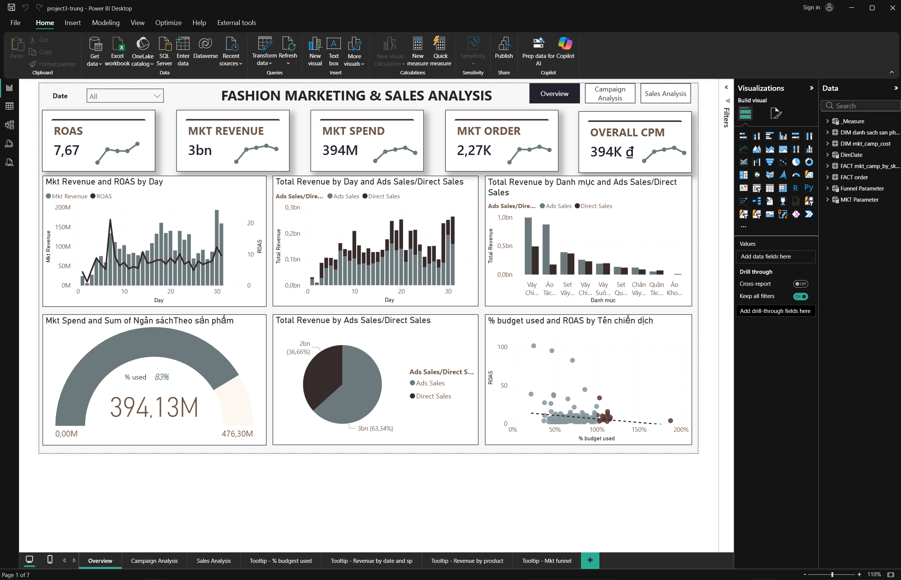

# Power BI Marketing & Sales Performance Dashboard

## Project Overview

This project analyzes marketing and sales performance using Power BI to identify trends in revenue, profitability, advertising efficiency, and customer purchasing behavior.

The dashboard enables stakeholders to monitor key business KPIs, evaluate marketing campaign performance, optimize advertising spend, and support data-driven decision-making through interactive visual analytics.

---

## Business Objectives

- Monitor overall revenue and profit performance
- Analyze marketing campaign effectiveness
- Evaluate ROAS (Return on Ad Spend)
- Track customer purchasing behavior
- Measure advertising efficiency across campaigns
- Identify high-performing products and channels
- Support strategic business and marketing decisions

---

## Tools & Technologies

- Power BI
- Power Query
- DAX

---

## Data Preparation

The dataset was cleaned and transformed using Power Query before building the data model and dashboard visualizations.

Data preparation tasks included:

- Handling missing values
- Converting data types
- Formatting date columns
- Creating calculated columns
- Building relationships between tables
- Optimizing the data model for reporting
- Merging marketing and sales datasets

---

## Key KPIs

- **Total Revenue**
- **Total Profit**
- **Marketing Spend**
- **ROAS (Return on Ad Spend)**
- **Average Order Value**
- **Total Orders**
- **Total COGs**
- **Total CPC**
- **Total CPM**
- **Total CTR**
- **Impressions**
- **Clicks**
- **Comments + Inbox**
- **% Budget Used**

---

## Dashboard Features

- Interactive slicers and filters
- KPI summary cards
- Marketing campaign analysis
- Revenue and profit analysis
- Advertising performance tracking
- Time-series trend visualization
- Customer purchasing behavior analysis
- Dynamic charts and visual reports
- Business and marketing performance comparison

---

## Sample DAX Measures

### Total Revenue

```DAX
Total Revenue =
SUMX(
    'FACT order',
    'FACT order'[Giá] * 'FACT order'[Số lượng]
)
```

### Marketing Spend

```DAX
Mkt Spend =
SUM('FACT mkt_camp_by_sku_cost'[ Tiền đã chạy Theo Sản phẩm ])
```

### ROAS

```DAX
ROAS =
[Mkt Revenue] / [Mkt Spend]
```

### Total Profit

```DAX
Total Profit =
SWITCH(
    SELECTEDVALUE('FACT order'[Ads Sales/Direct Sales]),
    "Ads Sales",
        [Total Revenue] - [Total COGs] - [Mkt Spend],
    "Direct Sales",
        [Total Revenue] - [Total COGs]
)
```

### Average Order Value

```DAX
Average Order Value =
[Total Revenue] / SUM('FACT order'[Số lượng])
```

### Total CTR

```DAX
Total CTR =
SUM('FACT mkt_camp_by_sku_cost'[Click by AM]) /
SUM('FACT mkt_camp_by_sku_cost'[Lượt hiển thịTheo AM])
```

### % Budget Used

```DAX
% budget used =
VAR budget =
    SUM('FACT mkt_camp_by_sku_cost'[Ngân sáchTheo sản phẩm])

RETURN
DIVIDE([Mkt Spend], budget)
```

---

## Dashboard Preview



---

## Key Insights

- Marketing campaigns with higher ROAS generated significantly better profitability
- Certain product categories achieved ***high revenue but lower profit margins***
- Advertising spend strongly influenced sales growth during peak periods
- CTR and engagement metrics helped identify the most effective campaigns
- Customer purchasing behavior revealed high-value product segments
- Budget utilization varied across different marketing campaigns and channels

---

## Skills Demonstrated

- Data Cleaning & Transformation
- Data Modeling
- DAX Calculations
- Marketing Analytics
- Data Visualization
- Dashboard Design
---
